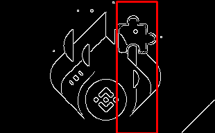

# opencv-puzzle-captcha-solver

> Python project that solves puzzle CAPTCHAs using OpenCV

Python project designed to solve various puzzle CAPTCHAs such as Geetest3, Geetest4, Binance, DataDome, TikTok, and others.

This project leverages OpenCV to process images and identify the position of the puzzle piece (slide) within the background image.

## Features

- Whitespace Removal
- Edge Detection
- Slide Positioning

## Getting Started

Create and activate virtual environment:

```bash
python3 -m venv .venv
source .venv/bin/activate
```

Install the required dependencies:

```bash
pip install -r requirements.txt
```

## How To Use

**Example**:

```python
from PuzzleCaptchaSolver import PuzzleCaptchaSolver

if __name__ == "__main__":
    solver = PuzzleCaptchaSolver(
        gap_image_path="demo/geetest4/1_slice.png",
        bg_image_path="demo/geetest4/1_bg.png",
        output_image_path="demo/geetest4/1_result.png"
    )
    position = solver.discern()
    print(f"The position of the slide is: {position}")
```

**Input Images**:

- Background Image

  > 

- Slide Image
  > 

**Output Image**:

> 

In the resulting image, the detected position of the sliding piece is highlighted with a **red** rectangle.

## Disclaimer

_This repository is created for informational/educational purposes only in cybersecurity field. I do not advise or condone violating the policies of any website._

&copy; 2026 All rights reserved.
